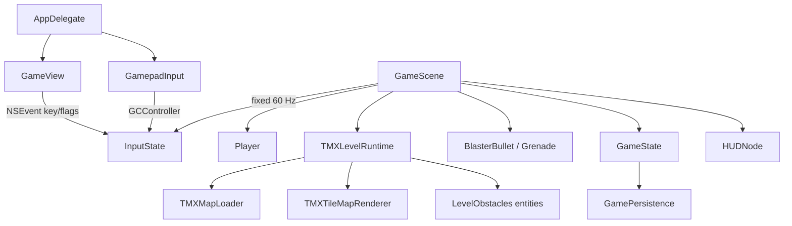

# Architect — runtime vs ORIGINAL_MECHANICS / README Step 9

**Route:** `7db1f3f0b126`\
**Session:** `exolon-initial-audit-20260919`\
**Intent:** review (no write_agent)\
**Host:** Linux only — no Swift, Xcode, or gameplay validation.\
**Product HEAD (route base):** `403eb1322d645154307ce11bf91be89e2082e1dd`

This is a bounded architecture/audit design, not an implementation plan. It compares the **implemented SpriteKit runtime** to `ORIGINAL_MECHANICS.md` and `README.md` Step 9 limitations. Every finding is tagged **Confirmed** (source-visible) or **Hypothesis** (needs macOS play or original-ASM cross-check). Unfinished Step 9 work is **not** treated as an accidental regression: `README.md:17` describes this tree as a runnable checkpoint, not a claim that every late-zone action is audited.

Companion analysis (do not duplicate):\
`evidence/analysis-docs_researcher.md` (intent/docs), `evidence/analysis-repo_explorer.md` (tree/pbx), `evidence/linux-static-audit.md` (TMX inventory).

---

## 0. How to read this report

| Tag | Meaning |
| --- | --- |
| **Confirmed** | Observable in Swift/TMX/docs without running the game. |
| **Hypothesis** | Plausible from source, but play, timing, or original ASM would be required. |
| **Claimed checkpoint** | README/Step 9 says this should already work (Zone 009 cabin, exo toggle/protection/reset, contextual UP). A miss here is a defect against the archive’s own claims. |
| **Known unfinished** | Original mechanic with no or partial runtime, already disclaimed by README / stale “dormant” comments. Not a regression. |

---

## 1. Current system

Single macOS AppKit + SpriteKit process. Eighteen Swift files, one `PBXNativeTarget`, no XCTest target (`analysis-repo_explorer.md`). All 125 screens share one runtime class.



### 1.1 Frame loop

- Logical canvas `512×384`, fixed step `1/60` s, accumulator cap `0.25` s — `GameConstants.swift:5-7`, `GameScene.swift:123-136`.
- `GameScene.fixedUpdate` (`GameScene.swift:148`) is the only gameplay owner: input → contextual UP → `Player.update` → solid resolve → weapons → level `fixedUpdate` → pickups / lethals → screen exit.
- Physics are **not** SpriteKit physics. Collisions are AABB vs merged TMX collision runs plus entity hitboxes.

### 1.2 Level pipeline

- `includedLevels` is the full `L01S01…L05S25` set — `GameScene.swift:53`.
- `TMXLevelRuntime.init` loads TMX, builds collision from the `Collision` layer, then `buildObjectsFromTMX` switches on **object name** (`TMXLevelRuntime.swift:235-415`). Unknown names are ignored on purpose (`default` at `:409-413`).
- `source_marker` is the compiler’s leftover for blocks that were not promoted to a named entity. Only some `sourceBlock` prefixes are handled (`beam_`, `topdown_electro`, `blinker`, `stage_end`, `changing_room`, `beacon_base`, `control_beacon`).
- Coordinate rule: tile-object Y is a **bottom** anchor; a Tiled rectangle must set `coordinateMode=tiledRect` — `TMXMapLoader.swift:73-81`. **Confirmed:** that property exists on exactly **one** object in 125 maps (Zone 009 `capsule`).

### 1.3 Persistence / flow

- `GameFlowState`: title, playing, paused, playerDead, respawning, gameOver, contentComplete — `GameState.swift:3-11`.
- Launch always Zone 000, high score kept, previous-process checkpoint discarded — `GameScene.loadPersistentState` (`:685-694`) matches `README.md:15`.
- In-session checkpoint writes ammo/grenades/points/lives/level **but not exoskeleton** — `GameScene.saveCheckpoint` (`:696-706`) vs `GameCheckpoint` (`GameState.swift:13-19`). Currently unused across process restarts.

### 1.4 What the runtime actually instantiates (125 TMX)

Object-name census (all maps present):

| TMX name | Count | Runtime case |
| --- | ---: | --- |
| `vitorc` | 125 | spawn only |
| `teleport` | 70 | `TeleportPortal` (35 pairs; no odd counts) |
| `mine` | 53 | `MineHazard` |
| `ammo_pack` | 48 | refill to 99 |
| `piston` | 46 | `PistonHazard` |
| `grenade_pack` | 38 | refill to 10 |
| `turret` | 37 | `TurretObstacle` (TOP / gunMachine1 / 4 legacy) |
| `bubble_creator` | 31 | `BubbleSpawner` (almost all `behavior=swing`) |
| `rocket` | 29 | **destructible sprite**, does not fire |
| `incubator` | 22 | birthpod + 8 eggs |
| `double_launcher` | 19 | fires + bonus-on-touch |
| `source_marker` | 127 | mixed: some live, 51 unhandled |
| `capsule` | 1 | Zone 009 changing room |
| `radar` / `cocoon` / `gate` | 12 / 1 / 6 | grenade-destructible scenery |
| `ship` / lights / `ship_fire` | scenery | no gameplay |

Unhandled `source_marker.sourceBlock` (**Confirmed**, matches `linux-static-audit.md`): `blk_gunMachine_BOTTOM` 18, `blk_waggon` 24, `blk_mushroom` 9 → **51**.

---

## 2. Intended mechanics vs implemented

Focus areas only. Broader original catalog is in `analysis-docs_researcher.md`.

### 2.1 Keyboard / controller input

**Intended (remake, not 1987):** separate FIRE and GRENADE (`ORIGINAL_MECHANICS.md:30`); UP is jump **and** contextual cabin/teleport (`README.md:23`); pause / test invulnerability are remake chrome.

**Implemented:**

| Control | Mapping | Citation |
| --- | --- | --- |
| ← → | move | `GameView.swift:50-53` |
| ↓ | crouch + menuDown | `:54-56` |
| ↑ | jump + menuUp | `:57-59` |
| Space | fire | `:60-61` |
| Option (keydown **and** `flagsChanged`) | grenade | `:17-26`, `:62-63` |
| P | pause (edge via `pausePressPending`) | `:64-65`, `InputState.swift:47-48,70-77` |
| F1 | debug hitboxes | `GameView.swift:66-67` |
| D-pad | same as arrows | `GamepadInput.swift:49-62` |
| Left stick | move (deadzone 0.35); crouch if Y < −0.65; **menuUp if Y > 0.65, never `.jump`** | `:64-72` |
| A / Cross | jump | `:77-79` |
| X / Square | fire | `:80-82` |
| B / Circle | grenade | `:83-85` |
| `controllerPausedHandler` | pause pulse | `:87-91` |

**Confirmed matches**

- Keyboard and D-pad UP feed `.jump`, so cabin/teleport share the jump edge — `GameScene.swift:229-253`.
- Contextual UP zeros `jump` for that step and latches `Player.jumpWasPressed` — `Player.consumeContextualJumpPress` (`Player.swift:256-258`). Holds cannot retrigger while `sceneJumpWasPressed` stays true (`GameScene.swift:229-230`). This implements `README.md:23` and teleport edge-trigger (`ORIGINAL_MECHANICS.md:102`).
- Pause is edge-triggered because gamepad pause is a pulse — `InputState.consumePausePress`.
- Window resign clears **keyboard** only — `GameView.windowDidResignKey` (`:42-44`).
- Test invulnerability is pause-menu only and non-original, as documented.

**Confirmed gaps**

1. **Left stick UP cannot jump, teleport, or enter a cabin.** Stick sets `.menuUp` but not `.jump` (`GamepadInput.swift:71`). D-pad UP and button A still work. Pause copy tells players to use D-pad for menus (`GameScene.swift:805`), but analog-up is the natural “UP” on a stick-centric pad.
2. **No `buttonMenu` / Options handler besides deprecated `controllerPausedHandler`.** Pause may be dead on some HID mappings (**Hypothesis** until macOS GameController is exercised).
3. **Option grenade is dual-pathed** (`keyDown` + `flagsChanged`). Likely OK; **Hypothesis:** Option can stick if a keyUp is dropped and `flagsChanged` does not run (e.g. focus loss — mitigated by resign-key reset).
4. Original “hold FIRE 15 ticks → grenade” is intentionally not implemented.

**Hypothesis (input)**

- Simultaneous left+right cancels motion (`Player.swift:94-95`); original Kempston behaviour not verified.
- No WASD / keyboard fire-as-grenade. Remake choice.

### 2.2 Collisions

**Intended:** TMX collision is the walk mesh; changing-room art must not block the trigger (`README.md:19-22`); mines use a **feet/narrow** window (`ORIGINAL_MECHANICS.md:70-71`); ducking must slip under turret shots (`GameConstants.swift:25-31`).

**Implemented:**

- Collision layer → horizontal-run AABBs — `TMXTileMapRenderer.buildCollisionRects` (`:115-149`).
- Player: separate **movement** (stand 46×63, crouch 46×52) and **damage** (crouch 46×49) boxes — `Player.swift:50-78`.
- Axis resolve: land, ceiling, then sides, with a deep-overlap fallback that restores previous X — `Player.resolveSolidCollision` (`:137-178`).
- Grounding is re-tested after resolve; elevated floors can be walked off — `refreshGroundSupport` (`:182-201`).
- `fallbackGroundY` is the **lowest** collision `maxY` (`TMXLevelRuntime.swift:70-78`). `landOnFallbackFloorIfNeeded` will not let the player fall below that net (`Player.swift:291-297`).
- Changing-room and destroyed-beacon volumes are subtracted from terrain — `TMXLevelRuntime.terrainRects` (`:97-122`), `subtract` (`:447-479`).
- Entity solids: active turrets, destructibles, incubators — `solidRects` (`:124-130`). Portals/pistons/mines are **not** solids.

**Confirmed — cabin exclusion vs its own comment (claimed checkpoint)**

Zone 009 `capsule` is the documented 32×80 Tiled rect at `(368, 176)` with `coordinateMode=tiledRect` (`L01S10.tmx:66-70`, `README.md:9`).

World trigger: `x=368, y=384-176-80=128`, size 32×80.

Exclusion (`TMXLevelRuntime.swift:301-306`):

```text
x = trigger.minX - 16 = 352
y = trigger.minY - 16 = 112    // comment says 16 px ABOVE the platform
w = max(96, 32+64) = 96
h = 80+32 = 112                // y = 112…224
```

The comment at `:297-300` says start **16 px above** the supporting platform so the floor stays solid. The arithmetic starts **16 px below** `trigger.minY`.

On `L01S10` the booth **is** the walk mesh: Collision rows 11–15, columns 23–27 are solid (Tiled y 176–256 ↔ SpriteKit y 128–208), matching the 80 px capsule. There is no extra floor slab under the booth; the next solids are the right-hand ground around SpriteKit y 64–96. Subtracting y 112–224 therefore removes **the entire booth floor**.

**Playable implication (Hypothesis until macOS):** Vitorc cannot stand inside the Zone 009 booth; he falls to the ground under it. The 63 px standing box on that ground (`y≈96…159`) still **intersects** the trigger (`y=128…208`), so UP may toggle the suit from *under* the cabin without entering it.

The same `minY - 16` formula is used for the four `source_marker` / `blk_changing_room` screens (`TMXLevelRuntime.swift:371-379`), with a looser 80×96 synthesized trigger. README’s “exclusion by object type on every changing-room screen” is implemented, but the rectangle is consistently biased into the floor.

**Confirmed — other collision facts**

- Mines: trigger rect is hitbox expanded −10/+20 X and height 28, using **movement** box — `MineHazard.triggerIfPlayerEnters` (`LevelObstacles.swift:746-756`). Matches “narrow feet region” better than full-sprite overlap.
- Pistons: lethal only while `hitbox.width > 0` (visible above `groundY`) against **damage** box — `PistonHazard.hitbox` (`:341-346`), `GameScene.swift:556-565`.
- Turret bullets are not player-shootable; double-launcher shots are — `EnemyTurretBullet` (`LevelObstacles.swift:137-152`), `GameScene.updateBullets` (`:371-381`).
- `sourceHazards` is declared and tested (`TMXLevelRuntime.swift:29`, `GameScene.swift:574-577`) but **never appended**. Dead path. High-voltage markers are explicitly non-lethal (`TMXLevelRuntime.swift:361-365`).
- Early maps `L01S01…S04` still use base64 collision (not CSV). `linux-static-audit.md` notes this; decode/play not done here.
- `L01S04.tmx` references `../images/tiles.gif` (missing). **Hypothesis:** tileset render fail; Zone 004 also has `zone004_scenery.png` / image layer.

**Hypothesis (collision)**

- Multi-solid resolve order can leave residual overlap on corners (single-pass AABB).
- Crouch damage 49 px is a remake tweak (`GameConstants.swift:25-31`), not original pixel data.
- Destroyed missile-base subtraction opens the Zone 008 route as commented (`TMXLevelRuntime.swift:100-111`). Needs play to confirm the 4×3 cell rect matches the wall.

### 2.3 Cabin / teleport interactions

**Intended**

- Cabin: align + edge UP, toggle suit (`ORIGINAL_MECHANICS.md:113-114`, `README.md:12`).
- Teleport: never automatic; align in a **pair**; one edge; hold must not retrigger; small X adjust + particles (`ORIGINAL_MECHANICS.md:98-103`).
- Contextual UP must not become a jump on the next fixed step (`README.md:23`).

**Implemented**

Order in `GameScene.fixedUpdate` (`:233-245`): **cabin first**, else teleport. Both require `jumpJustPressed` and `!player.isDying`.

| | Cabin | Teleport |
| --- | --- | --- |
| Presence test | `changingRooms.intersects(movementHitbox)` | `TeleportPortal.fullyContains` — whole movement box inside 64×96 **and** midpoint in 32×48 inner rect (`LevelObstacles.swift:293-299`) |
| Geometry | Zone 009: 32×80 tiledRect. Others: 80×96 from `sourceX/Y` | Sprite always 64×96; destination centre `left+24, floor+32` (`:290`) |
| Effect | `Player.toggleExoskeleton` + banner | `Player.teleport` + cyan flash (`GameScene.createTeleportFlash`) |
| Retrigger | edge + latch | same; `teleport` also sets `jumpWasPressed = true` (`Player.swift:213`) |

**Confirmed matches**

- 70 teleports, always pairs (35 screens). Zone 002 (`L01S03`) has two `teleport` objects.
- Five changing rooms: Zone 009 capsule; 034 / 060 / 090 / 109 as `blk_changing_room` markers. Type 12 count in `LEVEL_COMPILER_AUDIT.md` is 5 — 1:1.
- Hold-UP cannot loop teleports/cabins while the key stays down.
- Flashes exist; they are generic `SKShapeNode` circles, not original particles.

**Confirmed gaps**

1. Cabin alignment is **any intersect**, not the stricter teleport containment. A 32×80 booth vs a 46×63 collider is tight; an 80×96 synthesized booth (non-009) is loose. Not the same “aligned” rule.
2. Only Zone 009 has `tiledRect`. Other cabins ignore object x/y and synthesize from character cells (`TMXLevelRuntime.swift:371-373`). README called out Zone 009 as rebuilt from reference TMX; the other four remain source-marker approximations. **Known unfinished / not a 009 regression.**
3. Legacy teleports `L01S03` / `L01S07` have no width/height and no `tiledRect`. Placement uses bottom-anchor. **Hypothesis:** vertical error of one sprite height if those objects were authored as Tiled rectangles.
4. Destination “small X adjustment” is a fixed +24 centre, not a port of the original pixel delta. **Hypothesis** vs ASM.
5. `stageExitMarkers` are recorded (`TMXLevelRuntime.swift:369-370`) and **never read**. Stage end is “walk off x>510”, not the type-16 trigger.

### 2.4 Suit / exoskeleton reset and protection

**Intended (original):** toggle in cabin; persist through deaths until **stage end**; immunity only where the source calls `KillPlayer_unless_Exoskeleton` (mines, pumps); double blaster; stage end clears the flag and withholds 10 000 bravery (`ORIGINAL_MECHANICS.md:111-119,141-146`).

**README subset (claimed checkpoint):** UP toggles; double blaster; protect vs mines/pistons; **restart / new session** resets (`README.md:12-14`). README does **not** claim stage-end clear or bravery.

**Implemented**

| Rule | Code | Verdict |
| --- | --- | --- |
| Toggle on cabin UP | `GameScene.swift:234-238` | Confirmed present (entry geometry: see 2.3) |
| Double shot, +12 Y, **ammo −1 per trigger** | `GameScene.updateWeapons` `:346-351` | Confirmed double bullets. **Hypothesis:** original may debit 2; force-field “13 pulls because two bullets count separately” (`ORIGINAL_MECHANICS.md:124`) still works because each bullet is a hit |
| Sprite set | cyan tint, comment “temporary” | `PlayerSpriteNode.swift:43-46` — **known unfinished visual** |
| Persist through death | `finishDeathAndRespawn` / `respawn` do not clear the flag | Confirmed match to original |
| Protect mines / pistons | skip those loops if `hasExoskeleton` | `GameScene.swift:546,557` — Confirmed vs README |
| Mines under exo never **fire** | `continue` before `triggerIfPlayerEnters` | Confirmed difference vs “mine changes to spent state” (`ORIGINAL_MECHANICS.md:71`). **Hypothesis:** original still detonates visually |
| Other lethals (bullets, spheres, flyers, beam, missile) | no exo check | Confirmed match to “only `KillPlayer_unless_Exoskeleton`” |
| Restart / new process | `restartFromBeginning` `:963`; new `Player()` at launch | Confirmed vs README |
| Stage end clears suit | `applyOriginalStageBoundaryIfNeeded` `:622-631` awards lives/ammo **only**; **no** `setExoskeleton(false)` | Confirmed miss vs original; README does not claim it |
| Title after FULL COMBAT ABILITY | `beginFromTitle` unpauses in place, no reset | `GameScene.swift:708-717,761-767` — Confirmed: in-session “start” is not a new game |
| Checkpoint | no exo field | Confirmed |

**Confirmed — stage-end comment is stale, logic is live and partial**

```622:631:Exolon/GameCore/GameScene.swift
    private func applyOriginalStageBoundaryIfNeeded(completedZone: Int) {
        // ... deliberately dormant until later steps add Zones 024/049/074/099/124.
        guard [24, 49, 74, 99, 124].contains(completedZone) else { return }
        awardPoints(gameState.lives * 1_000)
        if gameState.lives < GameState.startingLives { gameState.lives += 1 }
        gameState.ammo = GameState.startingAmmo
        gameState.grenades = GameState.startingGrenades
    }
```

Those five TMX files exist (`L01S25`…`L05S25`) with `nextLevel` chained (124 → empty). Walking off Zone 024 **will** grant 1000×lives, maybe +1 life, refill ammo — **without** bravery 10 000, timed cursor, suit clear, or bonus UI. This is **partial live code**, not dormant. Classify as **known unfinished original sequence**, not a regression of a README claim. Testers should still know it fires.

Death **does not rebuild the zone**; destroyed objects stay destroyed (`GameScene.swift:328-329`). Original rebuilds (`ORIGINAL_MECHANICS.md:16`). Remake choice; call it a confirmed original deviation, not a Step 9 regression.

### 2.5 Action-marker runtime coverage (125 zones)

`ORIGINAL_MECHANICS.md:170` requires a runtime for every `game_init_actions.asm` marker. Compiler dump counts (`LEVEL_COMPILER_AUDIT.md:5`):

`2=101, 3=37, 4=341, 5=53, 6=70, 7=48, 8=38, 9=48, 10=46, 11=56, 12=5, 13=13, 14=92, 15=7, 16=5, 17=10`

Docs never print `2=torch`. The table below uses TMX `sourceBlock` / object names as evidence, not as an official enum.

| Type | Inferred marker | TMX / runtime | Coverage |
| ---: | --- | --- | --- |
| 2 | torches | no objects (101 unmatched) | **Known unfinished** visual/action; baked into backdrop |
| 3 | gun machines | 37 `turret` = 18 TOP + 15 `gunMachine1` + 4 legacy | **Live** |
| 4 | flashing cells | 19 `blk_blinker` no-op; 322 baked in | **Known unfinished** / intentional no-op for blinker |
| 5 | mines | 53 `mine` objects, 0 count mismatches | **Live** |
| 6 | teleport | 70 `teleport`, 0 count mismatches | **Live** (geometry caveats in 2.3) |
| 7 | white box | 48 `ammo_pack`, sets 99 | **Live** |
| 8 | yellow box | 38 `grenade_pack`, sets 10 | **Live** |
| 9 | sphere homes | 22 `incubator`; 48 type-9 cells | **Partial** — extra type-9 sit on swarm/bubble screens |
| 10 | pumps | 46 `piston`, 0 mismatches | **Live** |
| 11 | mixed | 18 `blk_gunMachine_BOTTOM` **unhandled**; ~38 cells belong to 19 `double_launcher` | **Partial** — see below |
| 12 | changing room | 5/5 | **Live mapping**, geometry issues in 2.2–2.3 |
| 13 | control beacon | 13/13 `blk_control_beacon` + bases | **Live** (one missile, grenade 150+850) |
| 14 | bonus / extra cells | 92; often 2 per double-launcher **or** gun-machine skirt | **Partial** — launcher uses sprite overlap, not type-14 rects |
| 15 | high voltage / ship-adjacent | 7; 2 `topdown_electro` no-op; 7 `ship` | **Known unfinished** HV; ships are scenery |
| 16 | stage end | 5 markers stored, unused; exit is x>510 | **Partial / unfinished sequence** |
| 17 | beam | 10 type-17; 10 `beam_up` **and** 10 `beam_down` each spawn a 25-hit field | **Live but duplicated** |

**Confirmed systematic holes (not late-zone accidents)**

1. **Lower gun machines never fire and are not grenade targets.** 18 `source_marker` / `blk_gunMachine_BOTTOM`, including Zone 023 `L01S24.tmx:56-61` (walkthrough checkpoint `ORIGINAL_MECHANICS.md:160`). `buildObjectsFromTMX` has no case. **Known unfinished** relative to README; **required** relative to original Zone 023.
2. **Rocket towers do not fire.** `rocket` / `blk_tower_rocket` → `DestructibleObstacle` (`TMXLevelRuntime.swift:264-269`). Original fires when the player is far (`ORIGINAL_MECHANICS.md:50-55`). **Known unfinished.**
3. **Waggon / mushroom** (33 markers) have no destroyable runtime; they remain backdrop. Grenade cannot score 150 on them. **Known unfinished** generic destroyable table.
4. **Flying enemies** are `BubbleSpawner` with `swing` (plus unused `circular`/`zig_zag` code paths). Original: `tab_enemy` + six literal trajectory tables, max 6 slots, spawn gate at X≥84 orig (`ORIGINAL_MECHANICS.md:87-96`). **Known unfinished.** Zone 003 still has a `bubble_creator` (`L01S04`).
5. **Timed indestructible pursuer** — no type, no class, no timer. **Known unfinished.**
6. **Force field construction:** `source.contains("beam_")` (`TMXLevelRuntime.swift:356-360`) builds a fixed 48×272 box per **up and down** marker. Zone 035 (`L02S11`) has both. Original: one beam to the next no-walk, 25 hits (`ORIGINAL_MECHANICS.md:121-126`). **Confirmed over-instantiation;** whether the player must land 50 hits is **Hypothesis** (boxes are 16 px apart in X and may both overlap the visible shaft).
7. **Double-launcher bonus** (`collectBonusIfTouched`, `LevelObstacles.swift:718-723`) uses the **sprite hitbox**, sets `isActive=false`, and fades the launcher — which also **stops firing**. Original: invisible bonus region once; launcher keeps existing and only suppresses fire when close (`ORIGINAL_MECHANICS.md:45-48,701-704`). **Confirmed logic mix-up.** Zone 006 is a walkthrough checkpoint.
8. **Early eight maps** (`L01S01…S08`) lack `zoneNumber` / `sourceX` / `sourceY`. They are a mixed legacy/reference set (no `zone_001…006_original.png`). Objects still have names, so many mechanics run; they are not the same compiler product as 008–124.

**Confirmed 1:1 (good)**

Mines, teleports, ammo, grenades, pistons, type-12 cabins, type-13 beacons, type-3 turret *count*, 125 `vitorc`, 125 `nextLevel` chain with 124 → empty.

---

## 3. Gaps classified

### 3.1 Against README claimed checkpoint (treat as defects if play agrees)

| ID | Item | Status |
| --- | --- | --- |
| C1 | Cabin collision exclusion punches the booth floor (`minY-16` vs “16 px above”) | **Confirmed code defect**; play = Hypothesis |
| C2 | UP in cabin/teleport is edge-consumed and will not jump that step | **Confirmed implemented** |
| C3 | Exo double blaster + mine/piston skip + restart/session reset | **Confirmed implemented** (entry to cabin may fail because of C1) |
| C4 | Exclusion runs for all five cabin screens by type | **Confirmed present**, same floor bias on marker cabins |
| C5 | Stick-UP is not contextual UP | **Confirmed input gap** vs “press UP” if testers use analog |

### 3.2 Against ORIGINAL_MECHANICS (mostly known unfinished)

| ID | Item | Status |
| --- | --- | --- |
| O1 | 18 lower gun machines | Confirmed missing runtime |
| O2 | Rocket towers | Confirmed non-firing destructibles |
| O3 | Type 2 torches, type 4 flash, type 15 HV, pursuer | Confirmed absent / no-op |
| O4 | Flying enemy tables | Confirmed generic swing bubbles |
| O5 | Stage bonus full sequence + exo clear + bravery | Confirmed partial live awards, missing rest |
| O6 | Zone rebuild on death | Confirmed remake deviation |
| O7 | Dual `beam_` 25-hit fields | Confirmed construction |
| O8 | Launcher bonus disables the launcher | Confirmed |
| O9 | Waggon/mushroom destroyables | Confirmed unhandled |
| O10 | Suit sprite sheet | Confirmed unfinished visual |

### 3.3 Flow / chrome (low gameplay, still source-true)

- Title overlay still says “STEP 10” (`GameScene.swift:832`) vs window “Step 9” (`AppDelegate.swift:16`).
- After Zone 124, SPACE → title → SPACE resumes the same parked player (`x>510`) and will re-enter `contentComplete`. Confirmed in-session loop. Launch-from-OS still Zone 000.
- `Info.plist` 0.3 vs pbx `MARKETING_VERSION` 0.5 (`analysis-repo_explorer.md`).
- No product tests.

---

## 4. Risk ranking

Rank is for **this audit’s focus**, not a ship/no-ship of the factory overlay. P0 = breaks a README-claimed cabin/input path. P1 = walkthrough checkpoint or systematic action hole. P2 = input/UX. P3 = chrome.

| Pri | ID | Finding | Kind | macOS needed? |
| --- | --- | --- | --- | --- |
| P0 | C1 | Zone 009 booth floor removed by exclusion | Confirmed code / Hypothesis play | **Yes — primary** |
| P1 | O1 | Zone 023 (and 17 other screens) lower gun dead | Confirmed unfinished | Yes, visual + grenade |
| P1 | O8 | Zone 006 bonus region = launcher suicide | Confirmed | Yes |
| P1 | O7 | Zone 035 may require 50 blaster hits | Confirmed dual objects | Yes, count shots |
| P1 | O5 | Stage 024/049/… awards fire without suit clear / bravery | Confirmed unfinished | Yes, with suit on |
| P1 | C3∩C1 | Suit toggle from **under** the booth | Hypothesis | Yes |
| P2 | C5 | Analog UP ≠ jump/cabin/teleport | Confirmed | Yes, pad |
| P2 | Input | Pause via Options on current GameController | Hypothesis | Yes, several pads |
| P2 | Flow | Post-124 title does not new-game | Confirmed | Yes |
| P2 | O2/O4/O3 | Rockets / flyers / pursuer / torches | Known unfinished | Only if scoring original completeness |
| P3 | Chrome | STEP 10 vs Step 9; version 0.3/0.5; cyan suit | Confirmed | Optional |

Do **not** file O2–O4, torches, pursuer, or full stage-bonus UI as regressions of this archive. README already declined that bar.

---

## 5. Architecture decisions (for a future write_agent — not this route)

This route has `write_agent: null`. If a later change is scoped, keep the current boundaries:

1. **Do not** invent a second level class. Extend `TMXLevelRuntime.buildObjectsFromTMX` name/`sourceBlock` cases.
2. **Do not** retune collision by painting Zone 009 tiles by hand. Fix the exclusion origin (`trigger.minY + 16` vs `- 16`) and keep `subtract`.
3. Promote `blk_gunMachine_BOTTOM` to `TurretObstacle` (or a muzzle-Y variant). Do not guess hitboxes for waggon/mushroom until ASM destroyable-table sizes are ported.
4. Split double-launcher **bonus region** from `isActive` firing. Type-14 cells are the data hint.
5. Treat `beam_up`+`beam_down` as **one** field (union to next no-walk), 25 hits total.
6. Stick UP should set `.jump` if cabin/teleport must be pad-reachable without Cross. That is a remake control decision; record it.
7. Stage-end: either implement the original sequence or keep the comment honest and the partial awards behind an explicit flag. Do not leave “dormant” comments on live `guard` code.
8. Characterization tests cannot run on this Linux host; any behaviour change needs a macOS XCTest or a scripted SKView harness.

Prefer existing `Player` / `InputState` / `TMXLevelRuntime` over new engines.

---

## 6. macOS evidence required

Linux cannot close P0/P1. The following is the minimum Xcode checklist. Record clip or notes per row; do not treat this Linux report as play confirmation.

### 6.1 Environment

- Open `Exolon.xcodeproj` on macOS, scheme Exolon, SDK macosx, deployment 10.14.
- Confirm Resources phase copies all 125 TMX and `zone_007…124_original.png`.
- Note `CFBundleShortVersionString` actually shown (plist 0.3 vs pbx 0.5).
- Keyboard and at least one extended GameController.

### 6.2 P0 — Zone 009 cabin (README)

1. Reach `L01S10` / zone 009 (invulnerability ON is allowed for transit).
2. F1 hitboxes: green movement vs blue terrain vs magenta/cyan portals. Confirm whether blue still fills the booth.
3. Walk into the 32×80 booth. **Must not fall through.** Must stand on booth floor.
4. Press UP once: banner EXOSKELETON ON, cyan tint, **no jump**.
5. Hold UP: no extra toggles until release.
6. Release, UP again: OFF.
7. With suit ON, step on pistons at x=64 and x=192, y=320 (`README.md:8`): survive. Toggle OFF: pistons kill (invuln OFF).
8. Repeat with D-pad UP, Cross, and **left stick UP** (expect stick to fail today).
9. Pause → Restart: suit off at Zone 000.

### 6.3 Input

| # | Case | Expect |
| --- | --- | --- |
| I1 | Arrows + Space + Option | move / fire / grenade |
| I2 | Option via flags only (press Option with no other key) | grenade edge |
| I3 | P pause, Space on RESTART | new game, suit off |
| I4 | D-pad UP in teleport Zone 002 | teleport, no jump |
| I5 | Hold UP in portal | single transfer |
| I6 | Stick UP in portal / cabin | document actual |
| I7 | Options/Menu pause on DualShock / Xbox / generic HID | document |
| I8 | Unplug pad | keyboard still live (`resetGamepad`) |

### 6.4 Walkthrough checkpoints (original; not all claimed by README)

| Zone | What to prove |
| --- | --- |
| 000 | Grenade destroys turret (and whether rocks/cocoon/gate follow) |
| 002 | Pair teleport |
| 003 | Flyer appears; trajectory vs generic swing |
| 005 | Incubator grenade → eggs |
| 006 | Shoot launcher rockets 50; close range stops fire; bonus 1000 **without** killing the launcher |
| 007 | Mines feet-trigger; exo skip |
| 008 | Missile not blaster-killable; grenade beacon stops missile and opens base collision |
| 009 | Cabin (6.2) |
| 023 | **Lower** gun fires and is grenade-able (expect fail today) |
| 024 | What actually happens at stage boundary with and without suit |
| 035 | Blaster hits to clear beam (25 vs 50) |
| 059 | Teleport to beacon |
| 124 | FULL COMBAT ABILITY then title then SPACE (expect stuck/re-complete) |

### 6.5 Static evidence already gathered (do not redo on macOS unless files change)

- 125/125 TMX on disk and in pbx.
- 18/18 Swift in pbx.
- Object/sourceBlock census in this file and `linux-static-audit.md`.
- No `swiftc` / `xcodebuild` on this host (`analysis-repo_explorer.md`).

---

## 7. Out of scope / not claimed

- No edits to `Exolon/`, `Exolon.xcodeproj/`, `README.md`, `ORIGINAL_MECHANICS.md`, `LEVEL_COMPILER_AUDIT.md`.
- No factory/Python behaviour.
- No assertion that TMX art matches 1987 pixels (visual audit is separate per `ORIGINAL_MECHANICS.md:170`).
- Action-type numbers are inferred from counts + TMX, not an official compiler enum.

---

## 8. Summary

The runtime is a single 60 Hz SpriteKit scene plus a name-driven TMX factory. Keyboard/D-pad contextual UP, exo double-fire, mine/piston immunity, restart reset, paired teleports, and 1:1 counts for mines/pumps/boxes/cabins/beacons are **implemented in source**. README’s cabin **collision** fix has a **confirmed inverted Y** in the exclusion rect; that is the highest-priority claimed-checkpoint risk and needs macOS proof. Lower gun machines, rocket fire, literal flyers, pursuer, torches, and the full stage-bonus ritual are **absent by construction** and should be tracked as Step 9 unfinished work, not as accidental regressions of this checkpoint archive.
